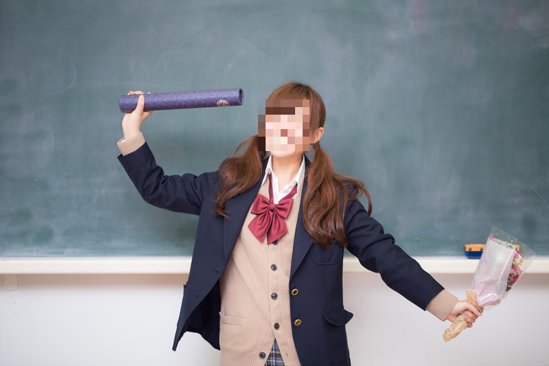

# FaceMosaic

複数の画像に対し，自動で人物を検出しモザイク処理を施します．

## インストール

Python 3.8.0 を利用して開発しました．
引数の処理にargparse，顔や人物の検出にはOpenCVを利用しています．
画像のプレビューを表示する場合はmatplotlibも必要です．

```
pip install argparse
```

```
pip install python-opencv
```

```
pip install matplotlib
```

## 使い方

```
python FaceMosaic.py -i INPUT_DIRECTORY -o OUTPUT_DIRECTORY
```

```
python FaceMosaic.py --help
```

## サンプル




## サンプル画像について

このレポジトリで使用している写真は，
[ぱくたそ](www.pakutaso.com）の写真素材を利用しています．
二次配布物の受領者がこの写真を継続して利用する場合は，
ぱくたそ公式サイトからご自身でダウンロードしていただくか，
ぱくたその[ご利用規約](www.pakutaso.com/userpolicy.html）に同意していただく必要があります．
同意いただけない場合は写真素材のご利用はできませんのでご注意ください．
